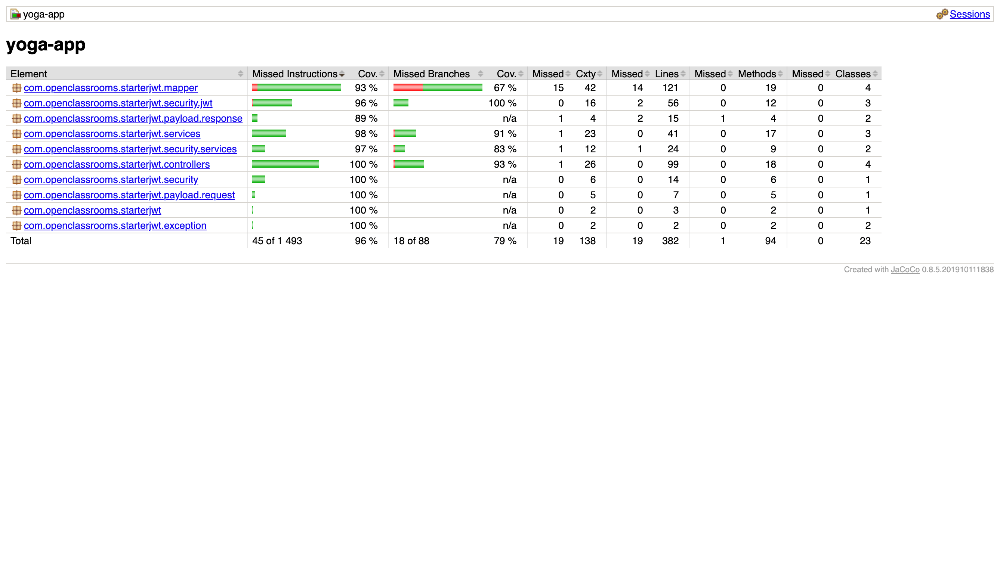

# 🧘 Savasana - Backend  

Welcome to the backend, built with **Spring Boot 2.6.1**. This REST API enables user authentication, session booking, and admin management of yoga classes.  

This README provides setup instructions and details on testing using **JUnit 5**, **Mockito**, and **Spring Security Test**.  

---

## 📂 Project Structure  

```
/back
│── /src/main/java/com/openclassrooms/yogaapp  # Application source code
│── /src/main/resources                        # Configuration files
│── /src/test/java/com/openclassrooms/yogaapp  # Unit and integration tests
│── /pom.xml                                   # Maven dependencies and build config
│── /README.md                                 # You are here
```

---

## 🛠️ Technologies Used  

- **Framework**: Spring Boot 2.6.1  
- **Database**: MySQL (H2 for tests)  
- **Security**: Spring Security, JWT  
- **Object Mapping**: MapStruct  
- **Testing**:  
  - **Unit & Integration**: JUnit 5, Mockito  
  - **Coverage**: JaCoCo  

---

## 📋 Requirements  

Before running the application, ensure that you have the following installed:  

- **JDK 11**  
- **Maven 3.8+**  
- **MySQL** (or Docker for database setup)  

---

## 🚀 Installation & Setup  

### 1️⃣ Install dependencies  
```sh
mvn clean install
```

### 2️⃣ Configure the database  

By default, the application uses **H2 in-memory** for testing. For tests with H2, configuration is already set in `back/src/test/resources/application-test.properties`.

```properties
spring.datasource.url=jdbc:h2:mem:testdb;MODE=MySQL;
spring.datasource.driverClassName=org.h2.Driver
spring.datasource.username=sa
spring.datasource.password=password

spring.sql.init.mode=always
spring.jpa.database-platform=org.hibernate.dialect.H2Dialect
spring.jpa.hibernate.ddl-auto=create-drop
spring.jpa.defer-datasource-initialization=true

spring.h2.console.enabled=true
spring.h2.console.path=/h2-console
spring.h2.console.settings.trace=false
spring.h2.console.settings.web-allow-others=false
```

To use MySQL, update `src/main/resources/application.properties` properties by creating an .env file with the following content:  

```properties
DATABASE=your_database_name
USERNAME=your_username
PASSWORD=your_password
```
```

### 3️⃣ Run the backend  
```sh
mvn spring-boot:run
```

API is now available at:  
```
http://localhost:8080
```

---

## ✅ Testing  

### 🧪 Unit & Integration Tests (JUnit & Mockito)  

JUnit 5 and Mockito ensure the reliability of individual components and their interactions.  

#### 📌 Run all tests  
```sh
mvn clean test
```

#### 📊 Test Coverage

To generate the coverage report:  
```sh
mvn jacoco:report
```

Coverage results will be available in:  
```
/target/site/jacoco/index.html
```

<div align="center">
  
</div>
You can see the coverage report by opening the `index.html` file in your browser :

```bash
open target/site/jacoco/index.html
```