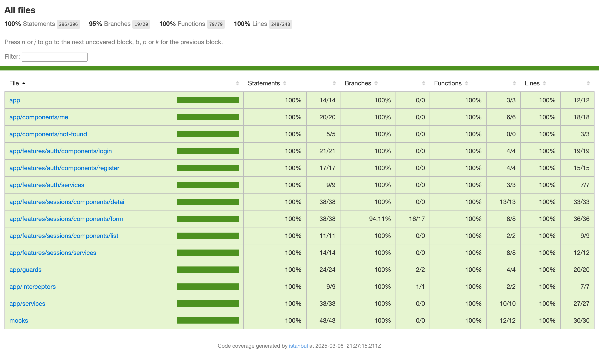
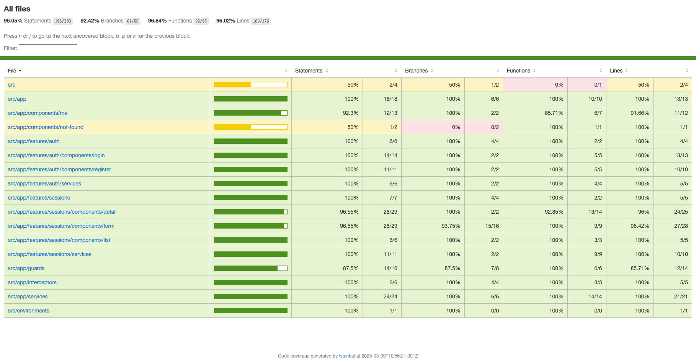

# 🧘 Savasana - Frontend

Welcome to the Savasana app frontend, built with **Angular 14**. This application allows users to register, log in, and book yoga sessions, while administrators can manage sessions and users.  

This README provides setup instructions and details on testing using **Jest** and **Cypress**.  

---

## 📂 Project Structure  

```
/front
│── /src           # Application source code
│── /cypress       # Cypress end-to-end tests
│── /jest.config.js # Jest configuration
│── angular.json   # Angular project configuration
│── package.json   # Dependencies and scripts
│── README.md      # You are here
```

---

## 🛠️ Technologies Used  

- **Framework**: Angular 14  
- **UI Components**: Angular Material, Angular Flex-Layout  
- **Testing**:  
  - **Unit & Integration**: Jest  
  - **End-to-End (E2E)**: Cypress  

---

## 📋 Requirements  

Before running the application, ensure that you have the following installed:  

- **Node.js 16**  
- **Angular CLI 14**  

---

## 🚀 Installation & Setup  

### 1️⃣ Install dependencies  
```sh
yarn install
```

### 2️⃣ Start the development server  
```sh
yarn start
```

This will launch the frontend at:  
```
http://localhost:4200
```

---

## ✅ Testing  

### 🧪 Unit & Integration Tests (Jest)  

Unit and integration tests ensure the reliability of individual components and services. Jest is used as the testing framework.  

#### 📌 Run all unit & integration tests  
```sh
yarn test
```

#### 🔄 Watch mode (re-run tests on file changes)  
```sh
yarn test:watch
```

#### 📊 Test Coverage  
Test coverage must be **at least 80%**, with at least **30% integration tests**.  

To generate the coverage report:  
```sh
yarn test --coverage
```

Coverage results will be available in:
```
front/coverage/jest/lcov-report/index.html
```

<div align="center" id="top"> 
  
</div>

You can also view the coverage report in your browser:
```bash
open coverage/jest/lcov-report/index.html
```
---

### 🌐 End-to-End (E2E) Tests (Cypress)  

Cypress is used to test the full user experience, ensuring the app functions correctly from **login** to **booking a session**.  

#### 📌 Run Cypress in interactive mode  
```sh
yarn cypress:open
```

#### 📌 Run Cypress tests in headless mode  
```sh
yarn cypress:run
```

#### 📌 Generate Cypress test coverage report  
```sh
yarn e2e:coverage
```

Coverage results will be available in:
```
front/coverage/cypress/lcov-report/index.html
```

<div align="center" id="top"> 
  
</div>

You can also view the coverage report in your browser:
```bash
open coverage/lcov-report/index.html
```
